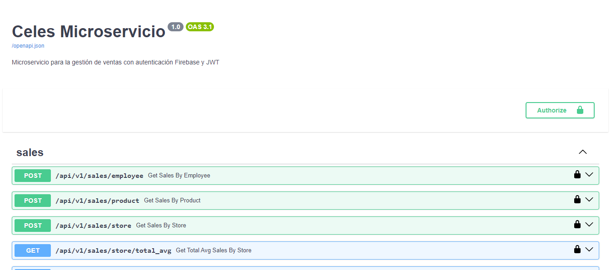
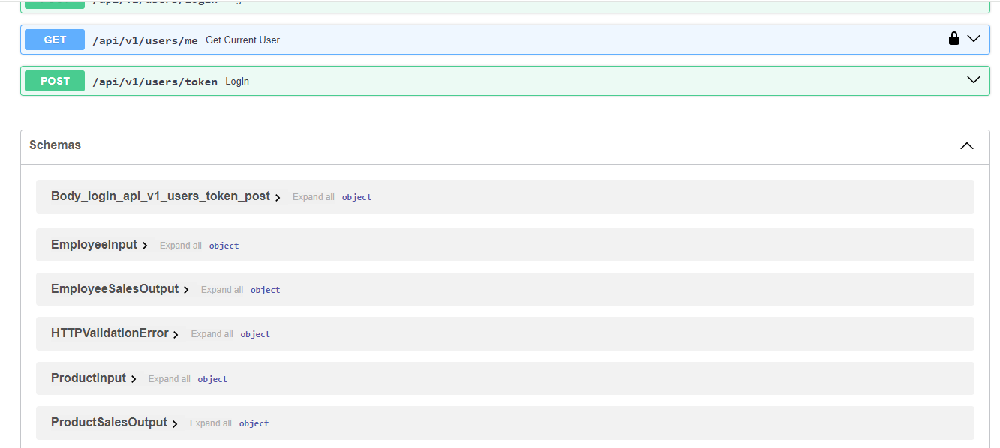
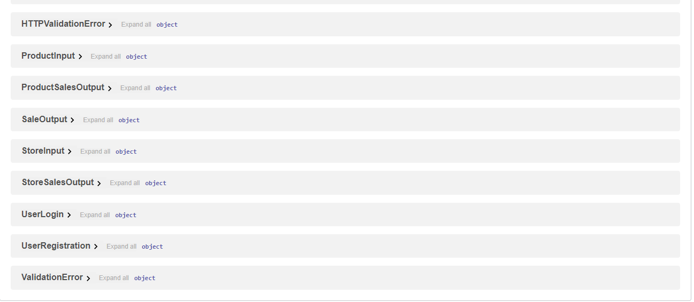

# FastAPI Project

This project is a FastAPI application with authentication using Firebase and JWT, along with CI/CD pipeline setup using GitHub Actions.

### Note:
Python must be installed if you want to test locally without Docker. You also need to have Docker and Docker Compose installed if you want to run the application with them.


## Project Structure

```plaintext
TechnicalTestForPython
├── app
│   ├── api
│   │   ├── endpoints
│   │   │   ├── sales.py
│   │   │   ├── user.py
│   │   │── dependencies.py
│   │   └── __init__.py
│   ├── core
│   │   └── config.py
│   ├── domain
│   │   ├── contracts
│   │   │   ├── infrastructures
│   │   │   │   ├── i_data_frame_manager.py
│   │   │   │   ├── i_data_loader.py
│   │   │   └── services
│   │   │       ├── i_sale_service.py
│   │   │       ├── i_user_service.py
│   │   ├── entities
│   │   │   ├── sales
│   │   │   │   ├── sale.py
│   │   ├── inputs
│   │   │   ├── employee_input.py
│   │   │   ├── product_input.py
│   │   │   ├── store_input.py
│   │   │   ├── user_login_input.py
│   │   │   ├── user_register_input.py
│   │   ├── outputs
│   │   │   ├── employee_sales_output.py
│   │   │   ├── product_sales_output.py
│   │   │   ├── sale_output.py
│   │   │   ├── store_sales_output.py
│   │   │   ├── user_model_output.py
│   ├── infrastructure
│   │   ├── data
│   │   │   ├── data_frame_manager.py
│   │   │   ├── data_loader.py
│   │   │──── firebase_config.py
│   │   │──── logging_config.py
│   │   │──── middleware.py
│   │   │──── token.py
│   ├── services
│   │   ├── sale_service.py
│   │   ├── user_service.py
│   │── main.py
├── tests
│   ├── api
│   │   ├── endpoints
│   │   │   ├── test_sales_endpoints.py
│   │   │   ├── test_user_endpoints.py
│   ├── domain
│   ├── infrastructure
│   │   ├── data
│   │   │   ├── test_data_frame_manager.py
│   │   │   ├── test_data_loader.py
│   ├── services
│   │   ├── test_sale_service.py
│   │   ├── test_user_service.py
├── .env
├── .env.example
├── .flake8
├── .gitignore
├── docker-compose.yml
├── Dockerfile
├── health_check.py
├── requirements.txt
├── README.md
```

## Installation

### Clone the repository:

```bash
git clone https://github.com/Desarrollo-zeros/TechnicalTestForPython/
cd TechnicalTestForPython
```

### Create and activate a virtual environment:

```bash
python -m venv venv
source venv/bin/activate  # On Windows: venv\Scripts\activate
```

### Install dependencies:
```bash
pip install --upgrade pip
pip install -r requirements.txt
```

### Set up environment variables:
Create a .env file in the root directory and fill in the required environment variables as specified in .env.example.


## Running the Application

### Using Docker

Build and run the Docker container:

```bash
docker-compose up --build #or docker compose up --build
```
#### Note: add -d if you don't want to see the execution process

#### Access the application:

Open your browser and navigate to http://localhost:8000.


## Without Docker

### Run the application

```bash
uvicorn app.main:app --host 0.0.0.0 --port 8000
```
#### Access the application:

Open your browser and navigate to http://localhost:8000.


## Running Tests

### Run the tests using unittest:

```bash
python -m unittest discover -s tests -p "*.py"
```

## CI/CD Pipeline

This project uses GitHub Actions for continuous integration and deployment.

### GitHub Actions Workflow

#### The workflow file is located at .github/workflows/ci-cd.yml. It performs the following steps:

- Checkout the code
- Set up Python environment
- Install dependencies
- Run tests
- Format and lint the code
- Build Docker image
- Deploy to server
- Health check

### Secrets Configuration

Set up the following secrets in your GitHub repository:

- VERSION_API
- DATA_DIRECTORY
- DATABASE_URL
- PROJECT_NAME
- DESCRIPTION
- MAX_SIZE_CACHE
- TTL_CACHE
- URL_DATA_EXAMPLE
- SERVICE_ACCOUNT_KEY
- ACCESS_TOKEN_EXPIRE_MINUTES
- SECRET_KEY
- FIREBASE_TYPE
- FIREBASE_PROJECT_ID
- FIREBASE_PRIVATE_KEY_ID
- FIREBASE_PRIVATE_KEY
- FIREBASE_CLIENT_EMAIL
- FIREBASE_CLIENT_ID
- FIREBASE_AUTH_URI
- FIREBASE_TOKEN_URI
- FIREBASE_AUTH_PROVIDER_X509_CERT_URL
- FIREBASE_CLIENT_X509_CERT_URL
- FIREBASE_UNIVERSE_DOMAIN
- URL_HEALTH
- SSH_PRIVATE_KEY

## Deployment

```yaml

- name: Deploy to server
  env:
    SSH_PRIVATE_KEY: ${{ secrets.SSH_PRIVATE_KEY }}
    USER_VPS: ${{ secrets.USER_VPS }}
    IP_VPS: ${{ secrets.IP_VPS }}
  run: |
    echo "$SSH_PRIVATE_KEY" > id_rsa
    chmod 600 id_rsa
    rsync -avz --exclude='.git*' --exclude='.github*' -e "ssh -i id_rsa -o StrictHostKeyChecking=no" . $USER_VPS@$IP_VPS:/var/www/myapp
    ssh -i id_rsa -o StrictHostKeyChecking=no $USER_VPS@$IP_VPS << 'EOF'
      cd /var/www/myapp
      docker-compose down
      docker-compose up -d --build
    EOF

- name: Health check
  run: |
    python health_check.py
```

## Logging Configuration

Logs are configured using Python's logging module in app/infrastructure/logging_config.py. All exceptions and errors are logged appropriately.

## Middleware

The middleware for authentication is set up in app/infrastructure/middleware.py, which validates tokens and adds services to the request state.

## Health Check

A basic health check is implemented in health_check.py to ensure the deployment was successful.

Replace <repository_url> with the URL of your repository. Ensure that all paths and file names are correct as per your project structure.


#### - This README.md covers the essential instructions for setting up, running, testing, and deploying your FastAPI application.


## Server IP Test

#### Service:
> http://154.38.180.23:8000
#### Docs:
> http://154.38.180.23:8000/docs






